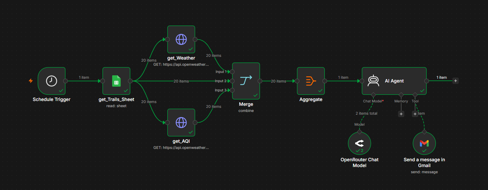

# Weather-Aware Hiking Agent 2

An AI-powered running location recommendation system built with **n8n** that analyzes **real-time weather and air-quality data** across 20 locations in India and uses an **LLM** to recommend the best destination for the day.

---

## Overview

This project is a complete rebuild of an earlier weather-aware hiking recommendation workflow.

The first version focused only on hiking locations around Hyderabad. Since the locations were geographically close to each other, their weather conditions were often very similar, which made the recommendations less meaningful.

The new version was rebuilt from scratch to address these limitations.

Instead of sending raw API responses directly to the AI Agent, the workflow first collects weather and air-quality data for each location, merges and structures the information, and then passes the processed data to the LLM.

The system now evaluates **20 running locations across India**, using accurate latitude and longitude coordinates to retrieve location-specific environmental data.

The AI Agent compares the processed information and recommends the **best running destination for the day**, along with an explanation and runner-up recommendations.

---

## What's New in Version 2

- Expanded from Hyderabad-only locations to **20 locations across India**
- Added **latitude and longitude** for accurate location-based API requests
- Added **real-time air-quality data**
- Added weather and AQI retrieval for **every location**
- Redesigned the workflow for cleaner data processing
- Added **Merge and Aggregate** stages before AI processing
- Prevented raw API responses from being passed directly to the LLM
- AI Agent now compares multiple locations before making a recommendation
- Generates the best location, reasoning, and runner-up recommendations

---

## Features

- Real-time weather analysis using **OpenWeatherMap**
- Real-time air-quality analysis
- Location-specific weather and AQI using latitude and longitude
- AI-powered running location recommendations using an **LLM**
- Comparison of 20 locations across India
- Automated data processing and aggregation
- Automated email delivery through **Gmail**
- End-to-end workflow orchestration with **n8n**

---

## Tech Stack

- **n8n**
- **OpenRouter (LLM)**
- **OpenWeatherMap API**
- **Google Sheets**
- **Gmail**
- **REST APIs**
- **OAuth 2.0**

---

## Workflow



---

## How It Works

1. The workflow is triggered on a schedule.
2. Running location data is retrieved from Google Sheets.
3. Each location's latitude and longitude are used to retrieve real-time weather data.
4. Air-quality data is retrieved for each location.
5. The weather and AQI data are merged with the location information.
6. The collected data is aggregated into a structured dataset.
7. The processed dataset is passed to the AI Agent.
8. The LLM compares the available locations and determines the best running destination.
9. The AI Agent also provides an explanation and runner-up recommendations.
10. The final recommendation is automatically sent through Gmail.

---

## Data Processing

A key design decision in this version was to **process the API data before sending it to the LLM**.

Instead of:

```text
Location
   ↓
Weather API
   ↓
Raw API Response
   ↓
AI Agent
```

the new workflow uses:

```text
Locations
   ↓
Weather API + AQI API
   ↓
Merge
   ↓
Aggregate
   ↓
Structured Data
   ↓
AI Agent
   ↓
Recommendation
```

This allows the LLM to focus on **reasoning and decision-making** rather than interpreting large and repetitive API responses.

---

## Repository Structure

```text
Weather-Aware-Hiking-Agent-2/
│
├── workflow/
│   └── running-location-recommender.json
│
├── screenshots/
│   └── workflow.png
│
└── README.md
```

---

## Setup

1. Import `running-location-recommender.json` into n8n.
2. Configure your own credentials for:
   - OpenRouter
   - OpenWeatherMap
   - Google Sheets
   - Gmail
3. Add the required running-location data, including latitude and longitude.
4. Configure the email recipient.
5. Execute or schedule the workflow.

> API keys and personal credentials are not included in this repository.

---

## Future Improvements

- Add precipitation probability and UV index
- Add user-specific running preferences
- Include distance from the user's location
- Add elevation and terrain information
- Add historical weather analysis
- Build an interactive dashboard for comparing locations
- Support additional environmental factors

---

## License

This project is licensed under the **MIT License**.
